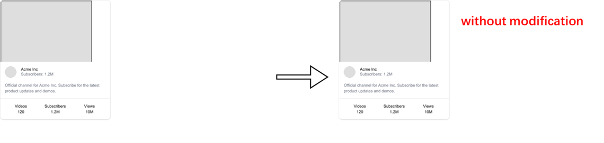
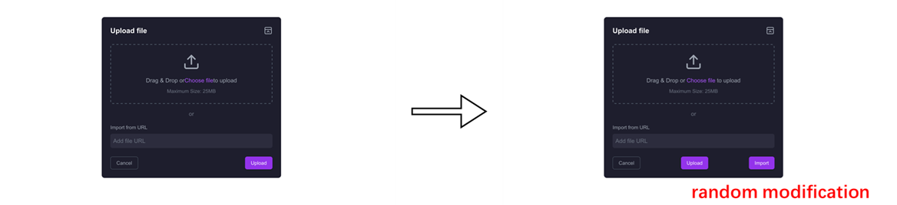
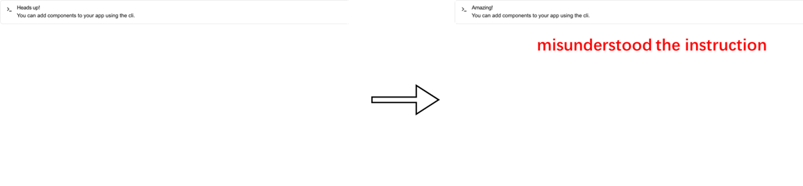
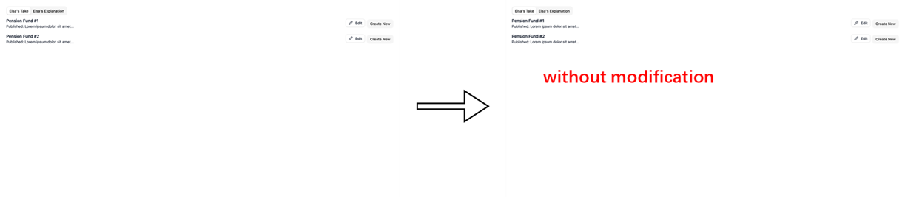
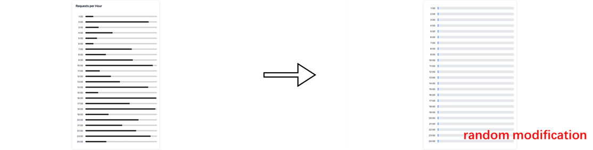

### Failed Edits (with instructions of low clarity)

- Example1

  Prompt: "use icons when appropriate"

  Frame: React

- Example2

  Prompt: "remove"

  Frame: React

- Example3

  Prompt: "make amazing"

  Frame: React

- Example4

  Prompt: "fix the error"

  Frame: Vue

- Example5

  Prompt: "wont show"

  Frame: Vue
  

